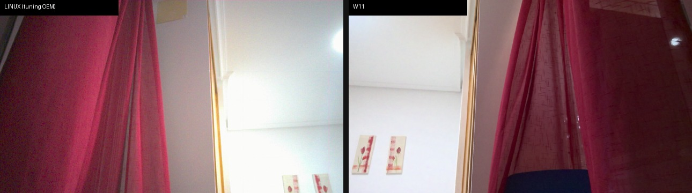

# Surface Pro 7+ cameras on mainline Linux — including the IPU6 hardware ISP

All three cameras of the Microsoft Surface Pro 7+ (Intel IPU6, Tiger Lake,
PCI `8086:9a19`) working on an ordinary Linux install — and, for the front
camera, through the **IPU6 hardware ISP (PSYS)** with Microsoft's own OEM
colour calibration loaded. As far as we know this is the first documented
working PSYS pipeline on a mainline(-ish) kernel: the mainline `intel-ipu6`
driver only implements the capture side (ISYS) and leaves the ISP half of
the silicon orphaned.

| camera | sensor | status | device |
|---|---|---|---|
| front | OV5693 | **hardware ISP (IPU6 PSYS)**: 1280x720@30 from the 2x2-binned sensor mode, OEM `.aiqb` tuning in Intel's HAL, ~7% CPU | `/dev/video80` — "Surface Front Camera" |
| IR (Windows Hello) | OV7251 | working, IR illuminator driven with the stream | `/dev/video81` — "Surface IR Camera" |
| rear | OV8865 | working via libcamera softISP, colour calibrated from the OEM tuning | `/dev/video82` — "Surface Rear Camera" |

All three appear in Chrome and any V4L2 app as ordinary webcams, start when
an application opens the device and stop when it closes — which matters
more than usual for the IR camera, since the illuminator is lit while it
streams.

Colour, next to Windows 11 rendering the same scene with the same module:



Full-size references: [Linux final](docs/images/linux_color_final.jpg) ·
[W11 video frame](docs/images/w11_video_frame.png). Measured against the
W11 render: white wall neutral to <2% (G/R 0.976 vs 0.965, G/B 1.007 vs
1.006), matched saturation (0.65 vs 0.64).

## Quick start

The canonical, self-contained rebuild playbook is
[`docs/REBUILD.es.md`](docs/REBUILD.es.md) (in Spanish for now — this README
covers the highlights; the playbook's commands and embedded code comments
are English or trivially readable). The short version:

1. **Kernel**: [linux-surface](https://github.com/linux-surface/linux-surface)
   (validated on Ubuntu 24.04, kernel 6.19.8-surface-3). The generic Ubuntu
   kernel does not enumerate these sensors.
2. **DKMS modules** ([`dkms/`](dkms/)): patched `ov5693` (front), patched
   `ov7251` (IR), patched `int3472` (sensor power for IR + rear), and
   `ipu6-psys-surface` (the hardware ISP; two-line clone-and-install, see
   its README). Plus v4l2loopback master. Mind the `autoconf.h` prerequisite
   in [`dkms/README.md`](dkms/README.md).
3. **Userspace**: for the front camera, Intel's `ipu6-camera-bins`,
   `ipu6-camera-hal` (with [`patches/ipu6-camera-hal-bggr-support.patch`](patches/ipu6-camera-hal-bggr-support.patch))
   and `icamerasrc`; for the rear camera, libcamera with
   [`patches/libcamera-local.patch`](patches/libcamera-local.patch) and the
   tuning file in [`config/tuning/libcamera/ov8865.yaml`](config/tuning/libcamera/ov8865.yaml)
   (the front's softISP tuning, [`ov5693.yaml`](config/tuning/libcamera/ov5693.yaml),
   is also included for reference); patched `v4l2-relayd`. Note the rear
   tuning sets an explicit 16-bit `blackLevel: 1024` — the softISP default
   swallows the pedestal on this short-exposure sensor and renders magenta.
4. **OEM tuning files** (not redistributable — extract them yourself):
   Microsoft ships the Intel colour calibration of all three cameras inside
   the public Surface Pro 7+ driver MSI:

   ```
   https://download.microsoft.com/download/0195da46-88f9-4f56-8046-babe15cafe2e/SurfacePro7+_Win11_22621_25.084.40018.0.msi   (~957 MB)
   ```

   Unpack with `msiextract`; under `SurfaceUpdate/Surface*extension/` take
   `OV5693_MSHW0220_TGL.aiqb` (front), `OV8865_MSHW0221_TGL.aiqb` (rear),
   `OV7251_MSHW0222_TGL.aiqb` (IR), and under `SurfaceUpdate/ov5693/` the
   `graph_settings_ov5693_13P2BA540_BIN_TGL.xml`. Patch the front `.aiqb`
   with [`tools/patch_aiqb_blc.py`](tools/patch_aiqb_blc.py) before
   installing it (see the black-level finding below).
5. **Bridges and services** ([`bridges/`](bridges/)): the loopback creator,
   the PSYS bridge (front), the softISP relay (rear) and the IR bridge, with
   their systemd units and a udev rule.

Then any V4L2 viewer works: `ffplay /dev/video80`.

## Technical highlights

### The OV5693 2x2-binned mode nobody had

The mainline `ov5693` driver defines a 1296x972 binned mode that never
worked on the IPU6 — so every prior effort read the sensor at full
2592x1944 resolution and downscaled, throwing away two stops of light and
pinning the AGC at its maximum analogue gain (127 vs ~15): the familiar
"working but unusably noisy" IPU6 front camera. Making binning actually
stream required all of these at once, extracted from the mode tables of
Windows' `ov5693.sys` ([`tools/extract_tables.py`](tools/extract_tables.py)):

- a **per-mode MIPI PLL** (`0x30b3`: `0x70` binned / `0x83` full) and six
  per-mode analogue readout registers — the mainline driver programs the
  full-resolution values once, globally, and the binned readout overflows
  the receiver's FIFO;
- **readout geometry with spare pixels**: cropping exactly the output size
  breaks the sensor's internal ISP (perpetual CSI-2 "Frame sync error").
  The vendor reads the whole pixel array and places the output window via
  ISP offsets — and the **parity of the Y offset selects the vertical Bayer
  phase**: even = BGGR (what the driver advertises), odd = GRBG. Windows
  uses Y=3 because its pipeline expects the flipped phase; a V4L2 consumer
  needs Y=2. Exposed as a module parameter (`binned_y_offset`), because the
  softISP path needs 2 and the PSYS path needs 1 (see below);
- **vertical flip is mode-dependent**: in binned mode only the sensor-side
  flip bit of `0x3820` may be set — both bits at once corrupt the CSI-2
  framing, the ISP bit alone streams but doesn't flip;
- a 30 fps VTS cap (the binned PLL cannot carry the 60 fps VTS) and
  `MIPI_CTRL00 (0x4800) = 0x2d` at stream-on, without which the IPU6 D-PHY
  never locks (that last register is linux-surface PR
  [#2171](https://github.com/linux-surface/linux-surface/pull/2171)'s fix).

### Intel's CPFF/`.aiqb` tuning format, deciphered

Microsoft's MSI carries the per-module OEM colour calibration in Intel's
CPFF/`.aiqb` container. Intel's own parser library segfaults on Intel's own
files; [`tools/decode_aiqb.py`](tools/decode_aiqb.py) walks the CMC record
chain directly (records at offset 0x50: `size u32, format u8, key u8,
name_id u16`; `name_id` 25 = advanced colour matrices) and extracts, per
illuminant, the sensor white point as R/G,B/G chromaticity (AWB gains are
the reciprocals), the CIE xy coordinates (CCT via McCamy) and the 3x3 CCMs.
That is what both colour pipelines here are calibrated from — the libcamera
tuning YAML for the softISP, and the (patched) `.aiqb` itself for the HAL.

### The black level ÷4 finding

Feeding the OEM `.aiqb` to the HAL unmodified renders everything green,
worst in the shadows. Root cause: the calibration stores black level ≈ 64.9
because **Windows' ISYS delivers RAW10 aligned to 12 bits** (pedestal 16.2
<< 2), while the **mainline ISYS delivers it LSB-aligned** (real pedestal
~16, measured dark at every analogue gain; the sensor's BLC registers are
identical to Windows'). The ISP was subtracting a constant 4x too large.
[`tools/patch_aiqb_blc.py`](tools/patch_aiqb_blc.py) rescales the two black
level records /4 and recomputes both self-excluding header checksums
(section and whole-file — without them the CCA rejects the file). The same
mismatch will apply to the rear camera's `.aiqb` when its PSYS pipeline is
brought up.

### PSYS on a mainline kernel

The PSYS module in [intel/ipu6-drivers](https://github.com/intel/ipu6-drivers)
is already structured to sit **on top of** the mainline `intel-ipu6` (it
binds the orphan `intel_ipu6.psys` auxiliary device; nothing is replaced),
and the `ipu6_fw.bin` in linux-firmware already contains the PSYS firmware
packages. What was missing:

- a build recipe against 6.19 (the module needs the kernel's private ipu6
  headers, which no headers package ships — bundled in
  [`dkms/ipu6-psys-surface/`](dkms/ipu6-psys-surface/));
- **three one-line-ish patches to Intel's HAL**
  ([`patches/ipu6-camera-hal-bggr-support.patch`](patches/ipu6-camera-hal-bggr-support.patch)):
  Intel only ever tested GRBG sensors, and a BGGR-advertising sensor hits a
  firmware stride assert (`PGUtils.cpp`), a wrong bytes-per-line (`Utils.cpp`)
  and a port-binding rejection (`PipeLiteExecutor.cpp`);
- a sensor profile for the HAL on the mainline media graph
  ([`config/ov5693-uf.xml`](config/ov5693-uf.xml), `mediaCfg=1`) and the
  orientation/Bayer-phase combination that satisfies both the sensor and the
  firmware: `vflip=1 hflip=1` in the profile + `binned_y_offset=1` (odd =
  GRBG) in the driver.

Result: sensor → ISYS → PSYS → NV12 at 30 fps, ~7% CPU, hardware denoise +
lens shading + sharpening, AE/AWB run by Intel's AIC against the OEM
calibration. The production service
([`bridges/surface-psys-bridge`](bridges/surface-psys-bridge)) runs the
pipeline on demand and works around the HAL's known intermittent stuck
start (first-frame watchdog, SIGINT, driver recycle, retry — measured first
frame ~0.3 s after a client opens the device when the start is good).

### Kernel bugs found along the way

- `GPIO_SUPPLY_NAME_LENGTH` in `int3472` is **5** (4 chars + NUL), so
  `dovdd` — a standard OmniVision supply name — literally cannot be mapped.
  The rear camera's second power rail also arrives as GPIO type `0x08`
  (POWER1), which released kernels ignore; without it the sensor never
  powers on (probe dies with -121). Our patch now follows Jakob Berg
  Jespersen's upstream fix for this
  ("[PATCH v2] platform/x86: int3472: support the POWER1 GPIO type",
  msgid `20260729-sp7plus-int3472-v2-1-cdfaf97ac3ad@berg.pm`), which maps
  POWER1 to a `dvdd` regulator generically, plus our INT347E → `vdda`
  mapping for the IR camera, which that patch does not cover.
- `ipu_bridge` leaks its software nodes on driver unbind: after a PCI
  remove/rescan of the IPU6 they linger in `/sys/kernel/software_nodes/`
  pointing into unloaded module rodata, and re-probe fails with `-EEXIST`.
  Consequence: never try to revive a wedged ISYS by PCI rescan; only a
  reboot recovers.
- (userspace, but in the same spirit) `v4l2-relayd` listens for the wrong
  loopback event ID; the real `CLIENT_USAGE` event is
  `V4L2_EVENT_PRIVATE_START + 0x08E00000 + 1`
  ([`patches/v4l2-relayd-client-usage.patch`](patches/v4l2-relayd-client-usage.patch)).

## Status and limitations

- **Desktop apps only probe `/dev/video0-63`** (Teams/Zoom native clients;
  see [linux-surface#2242](https://github.com/linux-surface/linux-surface/issues/2242)).
  With the loopbacks at 80-82, browsers see all three cameras but those
  native apps do not. If you need them, create the loopbacks below 64.
- **The HAL start is intermittent**: sometimes the ISYS delivers no frames
  at all. The PSYS bridge detects and retries this automatically (worst
  case ~12 s to first frame); the good case is ~0.3 s.
- **Low-light grain matches Windows' video pipeline, not its camera app**:
  the OEM tuning caps exposure at ~30 ms and spends the rest in analogue
  gain (Windows does the same — verified via EXIF). The visible advantage
  of the W11 camera app is its multi-frame ULL stacking, which this HAL
  build does not run. Not ported; the investigation and the measured
  dead-ends are in REBUILD §10.5.
- **Front camera is PSYS-only as configured**: with `binned_y_offset=1`,
  using it through libcamera renders magenta (Bayer phase mismatch). The
  softISP fallback is documented in [`config/README.md`](config/README.md).
- **Rear camera colour is not calibrated yet** (its OEM `.aiqb` decodes
  fine; same method as the front applies). Rear PSYS is future work.
- The libcamera and HAL patches are local; none of this is upstream yet.

## Hardware and software tested

- Microsoft Surface Pro 7+ (IPU6 Tiger Lake, PCI `8086:9a19`; front OV5693
  as ACPI `OVTI5693`, rear OV8865 as `INT347A`, IR OV7251 as `INT347E`).
- Ubuntu 24.04, linux-surface kernel 6.19.8-surface-3, linux-firmware's
  `ipu6_fw.bin`.
- libcamera @ `35c137c`, intel/ipu6-camera-hal @ master (patch verified
  against `6fefa86`), icamerasrc branch `icamerasrc_slim_api`,
  intel/ipu6-drivers @ `71bddb5`, v4l2loopback master, v4l2-relayd @
  `f14d6d4`.

Other IPU6 Tiger Lake machines with these sensors should be close (module
colour variation measured at ~9%; the tuning method is documented), but
only this machine is verified.

## Repository layout and licenses

| directory | contents | license |
|---|---|---|
| `patches/` | clean, `-p1`-applicable diffs against the baselines listed in [`patches/README.md`](patches/README.md) | kernel patches GPL-2.0 · libcamera patch LGPL-2.1+ · HAL patch Apache-2.0 · v4l2-relayd patch GPL-2.0 (each under its upstream's license) |
| `dkms/` | the four DKMS packages (patched sources + `dkms.conf` + installers) | GPL-2.0 |
| `bridges/` | the four bridge scripts, systemd units, udev rule | MIT |
| `tools/` | `.aiqb` decoder/patchers, Windows-driver table extractor, `autoconf.h` generator, test scripts | MIT |
| `config/` | HAL sensor profile (own work), libcamera tuning YAML, modprobe/modules-load snippets | MIT, except `ov5693.yaml` (CC0-1.0) |
| `docs/` | the full rebuild playbook + comparison images | CC-BY-4.0 (images are the author's own captures) |

License texts are in [`LICENSES/`](LICENSES/). **This repository contains no
Microsoft or Intel material**: no `.aiqb`, no `graph_settings*.xml`, no
`.sys`, no `ipu6-camera-bins` libraries — only instructions to obtain them
from public sources, and tools to decode/patch what you extracted yourself.

## How this was made — a human-guided AI engineering exercise

This project was undertaken as an experiment: to see how far reverse
engineering and systems bring-up can go with a capable AI doing the hands-on
work, guided closely by a human. The analysis, code, patches and measurements
were produced by **Anthropic's Claude (Fable 5, and Opus in earlier
sessions)** working directly on the machine — capturing raw frames,
disassembling the Windows drivers, deciphering the tuning format, iterating
against the hardware — with the direction, judgment calls, priorities and
real-world validation ("it looks upside down", "W11 still looks better")
provided by a human, D. Manresa. Every result described here was verified on
the actual hardware, most of it twice: once by the AI's measurements and once
by human eyes. Claude Fable 5 and Claude Opus are credited as co-authors in
the git history.

## Acknowledgements and prior art

- [linux-surface](https://github.com/linux-surface/linux-surface) — the
  kernel this runs on, and PR
  [#2171](https://github.com/linux-surface/linux-surface/pull/2171)
  (`MIPI_CTRL00`), the register that first made the OV5693 emit anything at
  all on the IPU6.
- [libcamera](https://libcamera.org)'s software ISP, which carried the
  colour cameras before (and the rear camera still).
- Intel's [ipu6-drivers](https://github.com/intel/ipu6-drivers),
  [ipu6-camera-hal](https://github.com/intel/ipu6-camera-hal) and
  [icamerasrc](https://github.com/intel/icamerasrc) — everything the PSYS
  path builds on.
- [umlaeute/v4l2loopback](https://github.com/umlaeute/v4l2loopback) and
  [9elements/v4l2-relayd](https://github.com/9elements/v4l2-relayd).
